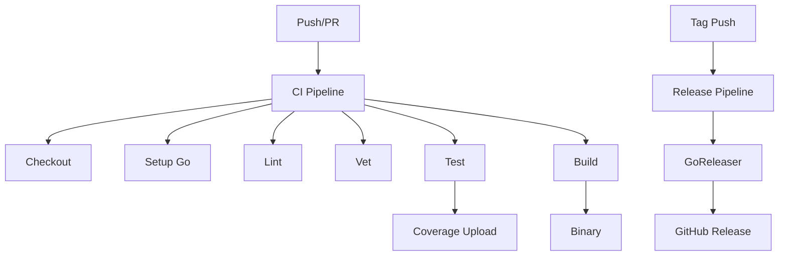

# NES-052 CI/CD

## 1. Status
- Status: Draft
- Version: 0.1
- Owner: NAEOS Core Team

## 2. Purpose
This specification defines the CI/CD pipeline for NAEOS, providing automated build, test, lint, security scanning, and release management.

## 3. Scope
The CI/CD layer covers:
- GitHub Actions workflows
- Build and test automation
- Lint and security scanning
- Release management with GoReleaser
- Code coverage reporting

## 4. Requirements
### 4.1 Functional Requirements
- FR-001: CI shall build and test on every push and PR.
- FR-002: CI shall run linting and vet checks.
- FR-003: CI shall generate and upload coverage reports.
- FR-004: Release shall create cross-platform binaries.
- FR-005: Security scanning shall run on schedule.

### 4.2 Non-Functional Requirements
- NFR-001: CI shall complete in <10 minutes.
- NFR-002: CI shall use concurrency groups to cancel redundant runs.
- NFR-003: CI shall use minimal permissions.

## 5. Architecture



## 6. Workflows

### 6.1 CI Pipeline (`ci.yml`)

| Step | Description |
|------|-------------|
| Checkout | Clone repository |
| Setup Go | Install Go 1.25 |
| Lint | `golangci-lint` built from source to match the target Go version |
| Vet | `go vet ./...` |
| Test | `go test -race -coverprofile=coverage.out` |
| Coverage | Upload to Codecov |
| Build | `go build ./cmd/naeos/` |

> Note: `golangci-lint` is installed in source mode in CI to ensure the linter binary is compiled with Go 1.25 and compatible with the repository's module Go version.

### 6.2 Release Pipeline (`release-goreleaser.yml`)

| Step | Description |
|------|-------------|
| Checkout | Clone repository |
| Setup Go | Install Go |
| GoReleaser | Build cross-platform binaries |
| Upload | Create GitHub Release |

### 6.3 Security Scanning (`codeql.yml`)

| Step | Description |
|------|-------------|
| CodeQL | Static analysis for security |
| Schedule | Weekly scan |

### 6.4 Documentation (`pages.yml`)

| Step | Description |
|------|-------------|
| Build | Generate documentation |
| Deploy | GitHub Pages |

## 7. Concurrency

```yaml
concurrency:
  group: ${{ github.workflow }}-${{ github.ref }}
  cancel-in-progress: true
```

| Feature | Description |
|---------|-------------|
| Group | Workflow + ref |
| Cancel | In-progress runs |

## 8. Permissions

```yaml
permissions:
  contents: read
```

| Permission | Level |
|------------|-------|
| Contents | Read-only |

## 9. Integration Points

| Consumer | How It Uses CI/CD |
|----------|------------------|
| `.github/workflows/ci.yml` | Main CI pipeline |
| `.github/workflows/release-goreleaser.yml` | Release pipeline |
| `.github/workflows/codeql.yml` | Security scanning |
| `.github/workflows/pages.yml` | Documentation |
| `.goreleaser.yaml` | GoReleaser config |

## 10. Acceptance Criteria
- [ ] CI builds and tests on every push/PR.
- [ ] Lint and vet checks pass.
- [ ] Coverage reports are uploaded.
- [ ] Release creates cross-platform binaries.
- [ ] Security scanning runs on schedule.
- [ ] CI completes in <10 minutes.
